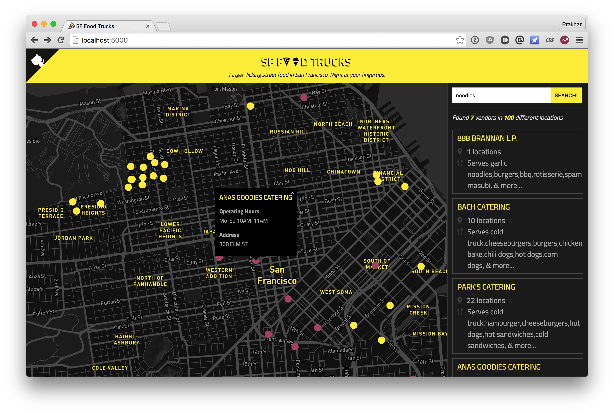

SF Food Trucks
===

> San Francisco's finger-licking street food now at your fingertips.



This is a fun application built to accompany the [docker curriculum](http://prakhar.me/docker-curriculum) which is a comprehensive tutorial on getting started with Docker targeted especially at beginners. The app is built with [Flask](http://flask.pocoo.org/) on the backend and [Elasticsearch](http://elastic.co/) is the search engine powering the searches. The front-end is built with [React](http://facebook.github.io/react/) and the beautiful maps are courtesy of [Mapbox](https://www.mapbox.com/).

If you find the design of the website a bit ostentatious, blame [Genius](http://genius.com) for giving me the idea of using this color scheme.  Lastly, the data for the food trucks is made available in public domain by [SF Data](https://data.sfgov.org/Economy-and-Community/Mobile-Food-Facility-Permit/rqzj-sfat).

#### Docker

There are two different ways of getting the app up and running with Docker. To learn more how these two differ, checkout the [docker curriculum](http://prakhar.me/docker-curriculum).

##### Docker Network
```
$ ./setup-docker.sh
```

##### Docker Compose
```
$ docker-compose up
```

The app can also be easily deployed on AWS Elastic Container Service. Once you have [aws ecs cli](http://docs.aws.amazon.com/AmazonECS/latest/developerguide/ECS_CLI_installation.html) installed, you can run the following to deploy it on ECS!
```
$ ./setup-aws-ecs.sh
```

Learn more at [docker-curriculum](http://prakhar.me/docker-curriculum).
